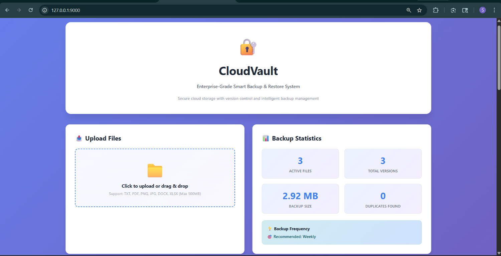
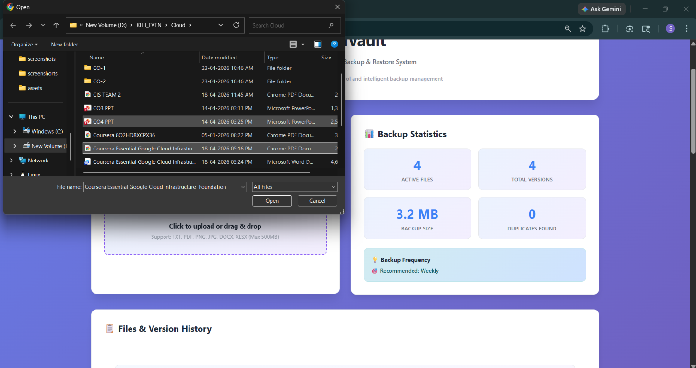
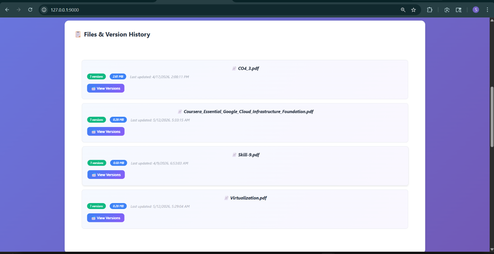
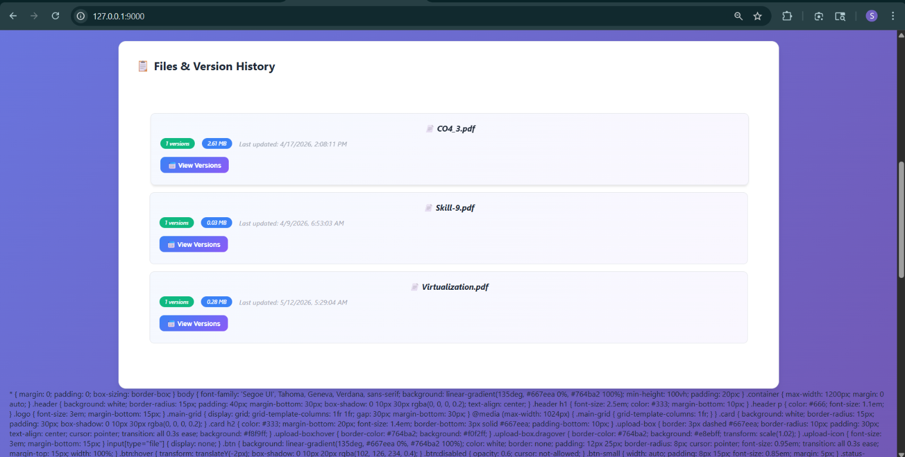
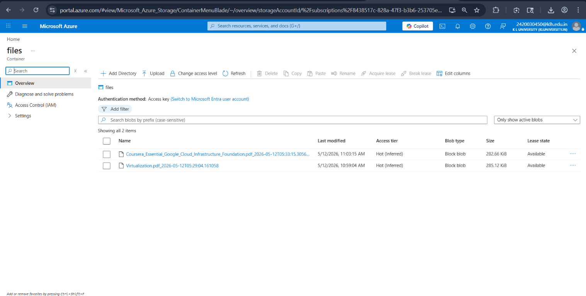

# Flask Azure Storage Integration

A Python Flask REST API that stores files in Azure Blob Storage and metadata in Azure Table Storage.

## Prerequisites

- Python 3.8 or higher
- Azure Storage Account
- pip (Python package manager)
- Azure CLI (optional, for creating storage resources)

## Setup Instructions

### 1. Create an Azure Storage Account

1. Log in to [Azure Portal](https://portal.azure.com)
2. Click "Create a resource" and search for "Storage account"
3. Create a new Storage Account with:
   - Resource Group: Create new or select existing
   - Storage account name: Choose a unique name (lowercase, 3-24 characters)
   - Region: Select your preferred region
   - Performance: Standard
   - Redundancy: LRS (Locally Redundant Storage)
4. Click "Create"

### 2. Get Your Connection String

1. Go to your newly created Storage Account in the Azure Portal
2. In the left sidebar, click **Security + networking → Access keys**
3. Copy the **Connection string** value under **key1**
   - Format: `DefaultEndpointsProtocol=https;AccountName=<name>;AccountKey=<key>;EndpointSuffix=core.windows.net`

### 3. Create Required Azure Storage Resources

#### Option A: Using Azure CLI (Recommended)

```bash
# Set your connection string
export AZURE_STORAGE_CONNECTION_STRING="DefaultEndpointsProtocol=https;AccountName=YOUR_ACCOUNT_NAME;AccountKey=YOUR_ACCOUNT_KEY;EndpointSuffix=core.windows.net"

# Create Blob Storage container
az storage container create \
  --name files \
  --connection-string "$AZURE_STORAGE_CONNECTION_STRING"

# Create Table Storage table
az storage table create \
  --name filemetadata \
  --connection-string "$AZURE_STORAGE_CONNECTION_STRING"
```

#### Option B: Using Azure Portal

**Create Blob Container:**
1. Go to your Storage Account
2. Click **Data storage → Containers**
3. Click **+ Container**
4. Name: `files`
5. Public access level: Private
6. Click **Create**

**Create Table:**
1. Go to your Storage Account
2. Click **Data storage → Tables**
3. Click **+ Table**
4. Table name: `filemetadata`
5. Click **Create**

### 4. Set Up Python Environment

```bash
# Navigate to project directory
cd /path/to/cis\ hackthonng\ porj

# Create a virtual environment
python3 -m venv venv

# Activate virtual environment
# On macOS/Linux:
source venv/bin/activate

# On Windows:
venv\Scripts\activate
```

### 5. Install Dependencies

```bash
pip install -r requirements.txt
```

### 6. Configure Environment Variables

**Option A: Using .env file (Recommended)**

```bash
# Copy the example file
cp .env.example .env

# Edit .env with your actual connection string
# macOS/Linux:
nano .env

# Windows:
notepad .env
```

Add your connection string:
```
AZURE_STORAGE_CONNECTION_STRING=DefaultEndpointsProtocol=https;AccountName=YOUR_ACCOUNT_NAME;AccountKey=YOUR_ACCOUNT_KEY;EndpointSuffix=core.windows.net
```

**Option B: Set environment variable in shell**

```bash
# On macOS/Linux:
export AZURE_STORAGE_CONNECTION_STRING="DefaultEndpointsProtocol=https;AccountName=YOUR_ACCOUNT_NAME;AccountKey=YOUR_ACCOUNT_KEY;EndpointSuffix=core.windows.net"

# On Windows (PowerShell):
$env:AZURE_STORAGE_CONNECTION_STRING="DefaultEndpointsProtocol=https;AccountName=YOUR_ACCOUNT_NAME;AccountKey=YOUR_ACCOUNT_KEY;EndpointSuffix=core.windows.net"

# On Windows (Command Prompt):
set AZURE_STORAGE_CONNECTION_STRING=DefaultEndpointsProtocol=https;AccountName=YOUR_ACCOUNT_NAME;AccountKey=YOUR_ACCOUNT_KEY;EndpointSuffix=core.windows.net
```

### 7. Run the Application

```bash
python app.py
```

The server will start at `http://localhost:5000`

You should see:
```
 * Serving Flask app 'app'
 * Running on http://0.0.0.0:5000
```

## API Endpoints

### 1. Health Check
```http
GET /health
```
**Response:**
```json
{
  "status": "healthy"
}
```

### 2. Upload File
```http
POST /upload
Content-Type: multipart/form-data

file: <binary file>
```

**Success Response (201):**
```json
{
  "status": "success",
  "message": "File example.txt uploaded successfully",
  "fileName": "example.txt"
}
```

**Error Response (400):**
```json
{
  "error": "No file provided"
}
```

**Supported file types:** txt, pdf, png, jpg, jpeg, gif, docx, xlsx

### 3. List All Files
```http
GET /files
```

**Response:**
```json
{
  "status": "success",
  "count": 2,
  "files": [
    {
      "fileName": "example.txt",
      "uploadedAt": "2024-01-15T10:30:45.123456"
    },
    {
      "fileName": "document.pdf",
      "uploadedAt": "2024-01-15T10:35:12.654321"
    }
  ]
}
```

## Testing with cURL

### Upload a file:
```bash
curl -X POST \
  -F "file=@/path/to/file.txt" \
  http://localhost:5000/upload
```

### List all files:
```bash
curl http://localhost:5000/files
```

### Health check:
```bash
curl http://localhost:5000/health
```

## Testing with Python Requests

```python
import requests

# Upload a file
with open('example.txt', 'rb') as f:
    files = {'file': f}
    response = requests.post('http://localhost:5000/upload', files=files)
    print(response.json())

# Get all files
response = requests.get('http://localhost:5000/files')
print(response.json())
```

## Quick Test Script

Use the included test script to validate your setup:

```bash
# In a new terminal (keep Flask running in first terminal)
python test_api.py
```

This will run all tests including:
- Health check
- File upload
- Invalid file type handling
- List all files
- Error handling

## Project Structure

```
.
├── app.py              # Main Flask application
├── test_api.py         # Automated test script
├── requirements.txt    # Python dependencies
├── .env.example        # Example environment variables
├── .gitignore          # Git ignore patterns
├── quickstart.sh       # Setup script for macOS/Linux
├── quickstart.bat      # Setup script for Windows
└── README.md           # This file
```

## How It Works

### File Upload Flow
1. User sends file via `POST /upload`
2. Application validates file type
3. File is uploaded to Azure Blob Storage container "files"
4. Metadata (filename, timestamp) is stored in Azure Table Storage table "filemetadata"
5. Returns success response with file details

### File Retrieval Flow
1. User requests `GET /files`
2. Application queries Table Storage for all entries with `PartitionKey="files"`
3. Returns JSON list with all uploaded files and upload timestamps

## Features & Screenshots

### 1. CloudVault Dashboard
The main interface provides a user-friendly experience for managing file backups:

- **Upload Files Section**: Drag-and-drop or click to upload supported file types
- **Backup Statistics**: Real-time display of active files, total versions, backup size, and duplicates
- **Backup Frequency Recommendations**: Weekly backup guidance for optimal data protection

### 2. File Upload Dialog
Seamless file selection interface integrated with your system:

- Browse local files from your system
- Support for multiple file types (TXT, PDF, PNG, JPG, DOCX, XLSX, GIF)
- Maximum file size: 500MB

### 3. Uploaded Files History
View your files after successful upload with complete history:

- Comprehensive list of all backup versions
- Quick access to version details
- Easy file recovery and management options
- Track all uploaded files with timestamps

### 4. Files & Version History
Track all uploaded files with version management capabilities:

- View all uploaded files with metadata
- Access multiple versions of each file
- Check file sizes and last modified timestamps
- Restore previous versions as needed

### 5. Azure Blob Storage Backend
Files are securely stored in Azure Cloud:

- Direct integration with Microsoft Azure Storage
- All uploaded files visible in the Azure Portal
- Encrypted storage with access control
- Reliable and scalable infrastructure

## Azure Storage Details

### Blob Storage Configuration
- **Container name:** `files`
- **Purpose:** Stores actual file content
- **File access:** Files are stored with their original filenames
- **Overwrite policy:** Existing files with same name are overwritten

### Table Storage Configuration
- **Table name:** `filemetadata`
- **Schema:**
  - `PartitionKey`: "files" (groups all file metadata together)
  - `RowKey`: filename (unique identifier per file)
  - `fileName`: the name of the uploaded file
  - `Timestamp`: automatically managed by Azure (upload time)

## Error Handling

The application handles:

- **400 Bad Request**
  - No file provided
  - Empty filename
  - Unsupported file type
  - Invalid filename characters

- **404 Not Found**
  - Invalid endpoint

- **500 Internal Server Error**
  - Missing Azure Storage connection string
  - Container not found
  - Table not found
  - Azure Storage service errors

## Environment Variables

### AZURE_STORAGE_CONNECTION_STRING (Required)
Connection string for Azure Storage Account. Format:
```
DefaultEndpointsProtocol=https;AccountName=<name>;AccountKey=<key>;EndpointSuffix=core.windows.net
```

Get this from:
- Azure Portal → Storage Account → Settings → Access keys → Connection string

## Troubleshooting

### "AZURE_STORAGE_CONNECTION_STRING environment variable not set"
**Solution:** 
- Ensure `.env` file exists in the project root
- Verify connection string is correctly set
- Check that `python-dotenv` is installed: `pip install python-dotenv`

### "Container 'files' not found"
**Solution:** Create the container using Azure CLI or Portal:
```bash
az storage container create --name files --connection-string "$AZURE_STORAGE_CONNECTION_STRING"
```

### "Table 'filemetadata' not found"
**Solution:** Create the table using Azure CLI or Portal:
```bash
az storage table create --name filemetadata --connection-string "$AZURE_STORAGE_CONNECTION_STRING"
```

### "Connection refused" or "Failed to connect"
**Solution:**
- Ensure Flask is running: `python app.py`
- Check port 5000 is available
- Verify your internet connection

### "InvalidAuthenticationInfo" or "AuthorizationPermissionMismatch"
**Solution:**
- Verify your connection string is correct
- Check that AccountKey is not truncated
- Regenerate access key in Azure Portal if needed

## Security Notes

- **File validation:** The application validates file extensions to prevent malicious uploads
- **Filename security:** Uses `secure_filename()` to prevent directory traversal attacks
- **Environment variables:** Never commit `.env` to version control
- **Production deployment:** Use Azure Key Vault to store connection strings
- **HTTPS:** Use HTTPS in production (Flask default is HTTP for local development)

## Dependencies

- **Flask==2.3.3** - Web framework for Python
- **azure-storage-blob==12.18.3** - Azure Blob Storage SDK
- **azure-data-tables==12.4.0** - Azure Table Storage SDK
- **Werkzeug==2.3.7** - Utility library for WSGI applications
- **python-dotenv==1.0.0** - Load environment variables from .env

## License

MIT License - Feel free to use this project as a template.

## Next Steps

1. ✅ Create Azure Storage Account
2. ✅ Create Blob container and Table
3. ✅ Get connection string
4. ✅ Create `.env` file
5. ✅ Install dependencies: `pip install -r requirements.txt`
6. ✅ Run app: `python app.py`
7. ✅ Test: `python test_api.py`

